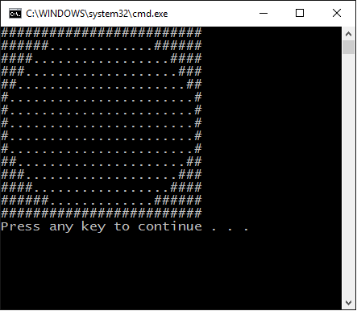

# Kata 1 - Introduction to Dependency Injection

The purpose of dependency injection is to make it easier to maintain code. It forces the consumers of a class to supply dependencies to that class before using it.  If we use interfaces, this promotes loose coupling between the dependencies and the class, and we should always be able to change the behaviour of dependencies without changing the class.

Dependency injection does not require a DI container. DI containers are optional libraries that can make it easier to compose components when we wire up an application. This kata focusses on dependency injection without a container and we will cover containers in a future kata.

## Poor Man's Dependency Injection

When you do dependency injection without a container, it's called Poor Man's Dependency Injection.

Here's the simplest example of dependency injection (specifically constructor injection):

```
private static void Main()
{
  IMessageWriter writer = new ConsoleMessageWriter(); // implements interface IMessageWriter
  var salutation = new Salutation(writer); // uses interface as dependency
  salutation.Execute();
}
```

## Tasks

### Task 1: Identify the entrypoint of the application

We have provided you with a console application that draws patterns.



Find the entry point of this application and learn about the different options it provides.

### Task 2: Extract dependencies to the top level of the application

Wire up the application in one place using constructor injection. To do this you will need to recursively extract all dependencies as new constructor parameters. If you have done this right, the only place that constructs objects will be the entrypoint of the application.

We encourage using R# as this codebase does not have tests.

### Task 3: Use a command line option to switch between patterns

We have provided three patterns for you to try. Unfortunately we only hooked one up.

Use the command-line option `--pattern` to switch between these. Do not use a container... yet!
